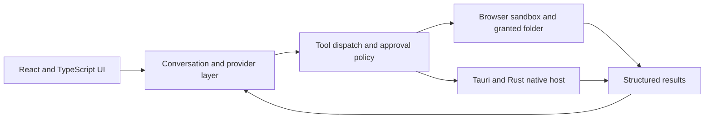

# KAOSLY AI — AI workspace and agent platform

KAOSLY AI is a cross-platform workspace for conversations and multi-step coding and research tasks. It has two product surfaces: **Normal Chat** for everyday use and **Jarvis Agent** for work with plans, files, tools, previews, memory, and user approvals.

The web app and Windows desktop app share a React and TypeScript interface. The Windows build uses a Tauri/Rust host for selected-folder files, managed processes, local speech, and secure credential storage. Browser execution stays within web permissions and a sandboxed workspace.

## What I built

- A shared conversation and provider layer that supports several model providers and normalizes their tool calls.
- An agent loop that records tool results, applies approval rules, and prevents accidental re-execution of completed calls.
- File, terminal, and preview experiences with different capabilities for the browser and Windows desktop.
- User-scoped cloud sync and a limited guest model path using Firebase Authentication, Firestore, App Check, and server-side functions.
- Architecture, security, and acceptance tests for provider handling, file boundaries, execution, and product workflows.

## Architecture

**Stack:** React, TypeScript, Vite, Tauri v2, Rust, Firebase Auth, Firestore, Cloud Functions, PWA tooling, Vitest.

## Verification and status

On 21 September 2026, the current development version passed TypeScript typechecking, 294 active Vitest tests, and a production web build. Three emulator tests were skipped. These checks cover the source and automated workflows; they do not establish a signed desktop release or a certified Android release.

The web and Windows desktop implementations are in development. Android source exists, with packaging and release certification deferred. The application source remains private while repository history and release preparation are reviewed.

